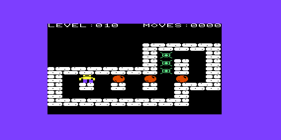
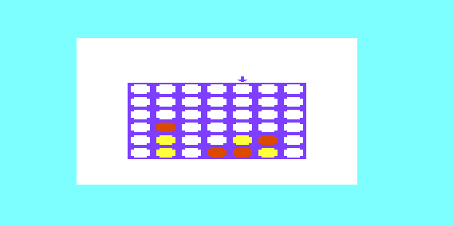

# VIC-20 assembly programs

The VIC-20 was my first computer when I was a child, and I regret not having been able to program complex things with it beyond BASIC. So some 30-40 years later, as a personal pleasure and a tribute to that little computer, I wrote these games in assembly, fully exploiting the limited, but quite complete, VIC's hardware. And indeed it can do amazing things when going low-level!

## Sokoban

This is a huge game in a small space! A port of sokoban game, see [my port of ksokoban](https://github.com/malessandrini/ksokoban-qt) for the original game. I managed to fit 153 levels from the "microban" level set in a few kilobytes. Available for 3k and 8k expansion (see d64 floppy images in Releases). It features multi-color graphics, keyboard and joystick, undo moves, codes to unlock levels and (8k version only) background two-voice music (interrupt-driven).

Press "H" for a complete list of keys. If you want to cheat, the code for the last level is ADHHKK (unlocks all levels from 1 to 153).

## Connect4

The connect4 game, for the unexpanded VIC, to be played against the computer (and it's quite strong). Use cursor+space or digits to play. See d64 floppy image in Releases.

